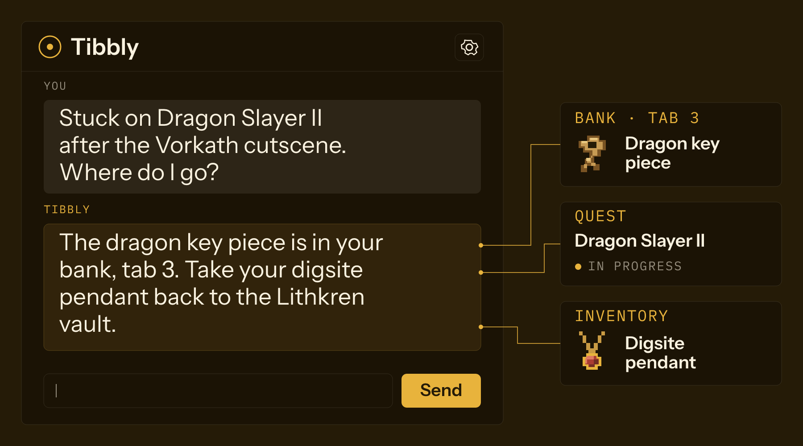
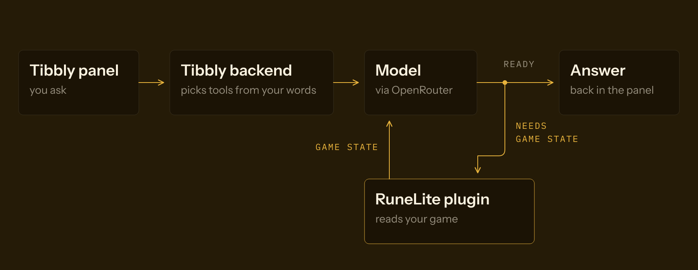

<p align="center">
  
</p>

<h1 align="center">Tibbly</h1>

<p align="center">Ask about Old School RuneScape inside RuneLite and get answers from your own bank, quests and gear.</p>

> [!NOTE]
> Tibbly is a work in progress. This README describes the product as it will ship.
> [Status](#status) lists what works today.



## Getting started

1. **Install Tibbly.** In RuneLite, open the **Plugin Hub**, search for Tibbly and click **Install**.
2. **Open the panel.** Click the gold speech bubble in the RuneLite sidebar. The **Tibbly** panel opens on your chats.
3. **Pair this device.** Click ⚙, then **Pair this device** under **Account**. Tibbly shows a code such as `ABC-123`. Enter it on your Tibbly account page. The panel then shows **Paired · @your-name**.
4. **Ask something.** Click **+ New chat** and type "What's in my bank?". Tibbly answers from your bank, not from a guide.

The free plan gives 30 messages a day and needs no card. Tibbly runs inside RuneLite, and RuneLite updates it through the Plugin Hub.

## Use

Open the settings with ⚙ at the top of the Tibbly panel. ← goes back to your chats.

| Setting               | Default                | Options                                                                                   |
| --------------------- | ---------------------- | ----------------------------------------------------------------------------------------- |
| Chat mode             | Tibbly cloud (managed) | Tibbly cloud, Direct: Anthropic, Direct: OpenAI, Direct: OpenRouter, Tools only (no chat) |
| BYO key               | empty                  | Your own provider key, for the Direct modes. Stored locally.                              |
| BYO model             | provider default       | Any model name the provider accepts                                                       |
| Show Tibbly companion | on                     | On or off                                                                                 |
| Personality           | Wiki veteran           | Four voices for the same companion                                                        |
| Voice override        | Dry wiki veteran       | Dry wiki veteran, Soft, confused friend, Sardonic veteran, Earnest helper                 |
| Verbosity             | 3                      | 1 to 5: how often Tibbly speaks unprompted                                                |
| Allow proactive lines | on                     | Lets the companion speak without being asked                                              |

The **Direct** modes send your question straight to that provider with your own key. Tibbly never sees the request. In these modes the model gets a summary of your game state but cannot ask for more.

You can also ask from the chatbox:

```text
::ai how many prayer potions do I have?
!ai what do I need for Monkey Madness?
```

Plans:

| Plan     | Price       | Model                               |
| -------- | ----------- | ----------------------------------- |
| Free     | £0          | Claude Haiku 4.5, 30 messages a day |
| Hobbyist | £7 a month  | Claude Haiku 4.5                    |
| Pro      | £19 a month | Claude Sonnet 4.6                   |
| Iron     | £49 a month | Claude Opus 4.7                     |

## How it works



Your game state stays in RuneLite. With each question, the plugin sends a short summary and the groups of tools your words point to. For example, "slayer" or "task" adds the slayer and combat tools. When the model needs more, such as the contents of a bank tab, it asks the plugin. The plugin reads that one thing from the game and replies. Sending only the tools a question needs keeps each message small and cheap.

## Limits

- **Tibbly only reads.** It never moves your character, clicks a tile or types in chat. RuneLite plugins that act for the player break the game's rules.
- **It knows what RuneLite can see.** Anything the client has not loaded, such as a bank you have not opened this session, is unknown to it.
- **The Direct modes have no tools and no chat history.** Each question is sent on its own with a game-state summary.

## Status

What works today:

- The backend starts, applies its database migrations and accepts plugin connections.
- The plugin's panel, settings, pairing and chat screens are written, but the plugin does not build (see below).
- Unit tests for the backend, marketing site and ops console pass. The scripted end-to-end run, with a fake plugin and a fake model, passes except for test 03 (GDPR export and delete).

Not done yet:

- **The plugin does not build.** Three types used by the companion code (`Starter`, `CompanionAtlasLoader`, `Direction`) were deleted in #80.
- **Tibbly is not on the Plugin Hub.** Today you build the jar and run RuneLite in developer mode.
- **The data-sharing consent has no switch.** Cloud chat, Direct chat and the companion all wait on it, so they stay off.
- **Tool calls are not connected.** The plugin answers every tool call with `not_yet_wired`, and the server gives the model no tools.
- **Pairing cannot finish.** No web page takes the code, and the plugin polls `/v1/pairing/status`, which does not exist.
- **The backend accepts only dev device keys** (those starting `DEVKEY_dev_`). It refuses to start with `NODE_ENV=production`.
- **Checkout, the billing portal and email sign-in are written but not mounted** in `apps/backend/src/server.ts`. The free plan limit is not enforced.
- **The companion has no art yet.** It draws a flat placeholder and does not speak.

## Build from source

You need [Bun](https://bun.sh) 1.3 and, for the plugin, a JDK. Gradle downloads JDK 11 if you do not have one.

```sh
bun install

# Backend on http://localhost:8787
cd apps/backend
bun run dev

# Tests
bun test                            # in apps/backend
bun run test                        # in apps/marketing or apps/ops
bun run test:e2e                    # from the repo root

# Plugin
cd apps/plugin
./gradlew shadowJar                 # jar in build/libs/
./gradlew runRuneLite               # RuneLite in developer mode, debugger on port 5005
```

Things that may surprise you:

- The backend reads `.env` from `apps/backend/`, because Bun loads it from the working directory. Copy `.env.example` there. Every variable is optional in development. `DATABASE_URL` defaults to a PGLite file, `./local.db`. A `postgres://` URL uses Postgres.
- The backend tests take about 10 minutes.
- Migrations run on every start. On start the backend also downloads the OpenRouter model list.
- The backend serves the ops console at `/ops/` after you run `bun run build` in `apps/ops`.
- The end-to-end tests build their own server with the real device lookup and tools. Passing them does not prove `server.ts` is wired the same way.
- The plugin accepts only `wss://` backend URLs, so it cannot reach a local `ws://` backend without a TLS proxy.
- `./gradlew check` also runs safety checks, for example no HTTP server and no plain `http://` URLs in the jar.
- `bun run dev` at the root also starts `./gradlew runRuneLite`.

More detail lives in [`docs/INDEX.md`](docs/INDEX.md).
