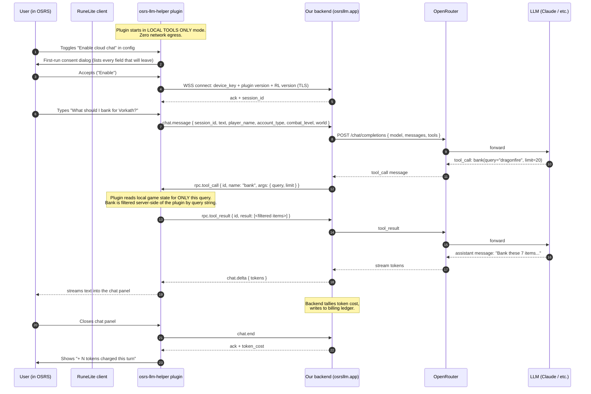
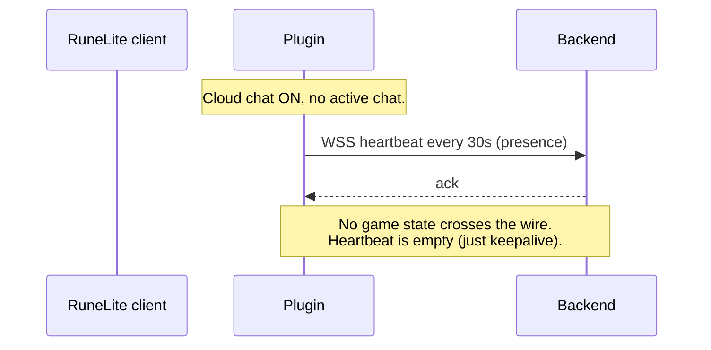
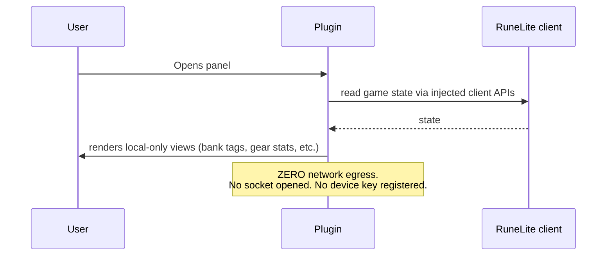
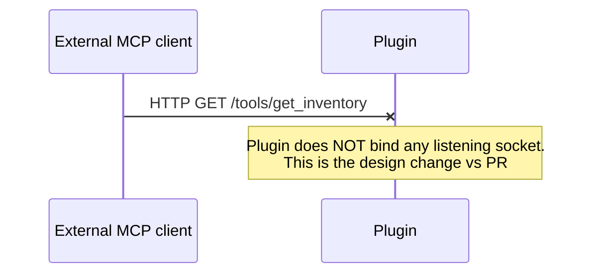

# Data Flow — RuneLite client → plugin → backend → OpenRouter → user

This document is the visual companion to `docs/runelite-hub/DATA_DISCLOSURE.md`.
It shows what packet leaves where, in what order, in response to what trigger.

## Compliance anchor

The Plugin Hub rejected PR #11453 ("Add OSRS MCP plugin") explicitly because
*"Plugins which expose player information over HTTP"* is on the rolled-back
list. That plugin ran a localhost HTTP/MCP server that external programs
connected to. **Our design inverts that flow** — the plugin makes a single
outbound WebSocket connection to our backend; tool calls arrive *into* the
plugin as RPC messages on that socket; the plugin returns results on the same
socket. No HTTP server is ever bound on the client.

## High-level lifecycle

## Idle-state behaviour (no chat in progress)

## Tool-only mode (cloud chat OFF — install default)

## What never happens

## Network endpoint summary

| Direction | Source | Destination | Protocol | Trigger |
|---|---|---|---|---|
| **Outbound** | plugin | `wss://api.osrsllm.app` | WSS (TLS 1.3) | Cloud chat enabled |
| Inbound — RPC | backend | plugin (over established WSS) | JSON-RPC over WSS | LLM tool call |
| **No inbound from non-backend sources** | — | plugin | — | — |
| Outbound | plugin | — | — | If cloud chat OFF, nothing else. |

## Per-tool egress matrix

See `docs/runelite-hub/DATA_DISCLOSURE.md` §D for the full per-tool table.
Each tool call returns *only* the fields needed to answer the LLM's question;
default `limit`s on bank/nearby/quest tools cap payload size.

## Backend → OpenRouter

The backend authenticates to OpenRouter with a single server-side API key
(loaded from `OPENROUTER_API_KEY` env var, never shipped to the plugin).
Per-user attribution is internal to our backend; OpenRouter sees only our
account.

## TLS / pinning

- The plugin trusts the system truststore for `api.osrsllm.app`. (Cert pinning
  is on the "later" list — it complicates RuneLite hot-deploy.)
- The plugin will refuse to connect if the TLS handshake fails. There is no
  insecure fallback.

## Failure modes

| Failure | Plugin behaviour |
|---|---|
| WSS connect fails | Show panel banner "Cloud chat unavailable — local tools still work". Retry with backoff. |
| Backend returns 5xx | Surface error to user; offer "retry". |
| Backend returns 402 (out of credits) | Surface to user with deep link to dashboard top-up. No silent retries. |
| Backend offline > 10 min | Show banner suggesting user disable cloud chat. Local tools keep working. |
| Plugin out of date | Backend may close the socket with `version_unsupported`; plugin shows "update available" banner. |
